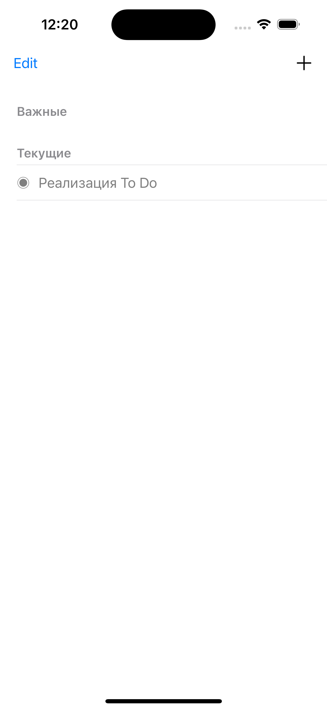
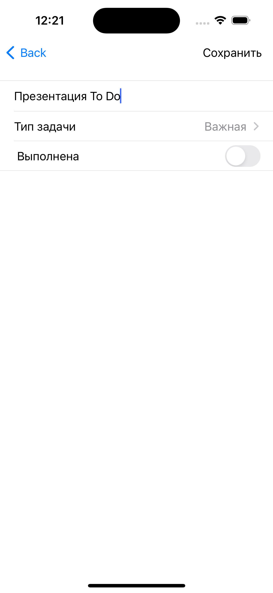

# To_Do

Реализация To Do списка на языке Swift.

## About

Стек технологий:
* UIKit.
* Life cycle applications.
* UINavigationController.
* UITableViewController.
* UserDefaults.

## How it work

> Main Screen: "+", чтобы создать задачу. "Edit" режим редактирования. Cвайп слево-направо для удаления. Cвайп cправо-налево для настроек.
  CreateScreen: "Сохранить" для создания/изменения.

## Example

  
  
  
  

## Support

tg: @swissmer